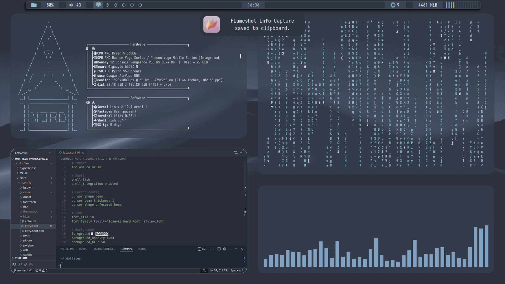
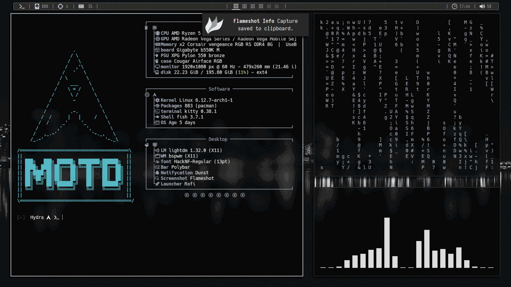

<h1> dotfiles </h1>

## Info

+ OS - [Arch Linux](https://archlinux.org/) 
+ WM - [Bspwm](https://github.com/baskerville/bspwm) / [Hyprland](https://hyprland.org/)
+ Terminal emulator - [Kitty](https://github.com/kovidgoyal/kitty)
+ Shell - [Fish](https://github.com/fish-shell/fish-shell)
+ Bar - [Polybar](https://github.com/polybar/polybar) / [Waybar](https://github.com/Alexays/Waybar)
+ Launcher - [Rofi](https://github.com/davatorium/rofi) / [Tofi](https://github.com/philj56/tofi)

## Rices

<h1 align="center">Nord</h1>

+ Browser - Firefox w/[NightTab extension config](https://pastebin.com/NPshcAeh) w/ [Css theme](https://github.com/BlueFalconHD/SimpleFox-Feather/) 
+ Icons [Nordzy](https://github.com/alvatip/Nordzy-icon)

<h1 align="center">MOTD</h1>

+ Browser - Firefox w/[NightTab extension config](https://pastebin.com/yx91UqqD) w/ [Css theme](https://github.com/BlueFalconHD/SimpleFox-Feather/) 
+ Icons [Suru++](https://github.com/gusbemacbe/suru-plus-aspromauros)

